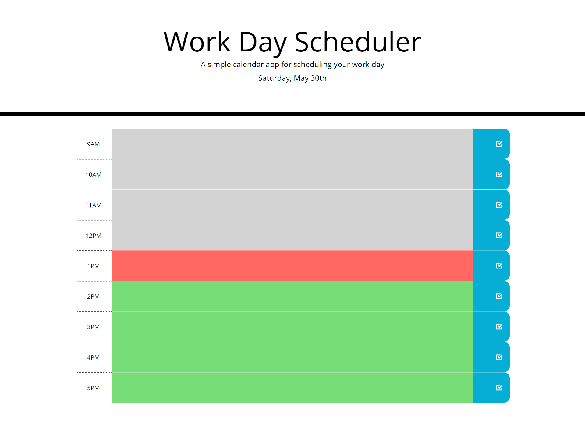

# Workday-Scheduler

https://tremigi.github.io/workday-scheduler/

The workday scheduler is a school project completed by adding to given HTML and CSS documents, and creating a new Javascript document. It features third party API's including jQuery, Bootstrap, and moment.js.

Please see repository issues page for future features, refactors, and bug fixes.

## Installation

No installation required.

## Libraries Used

HTML, CSS, Bootstrap, JavaScript, jQuery, and moment.js were used to create this application.

## Contributing
Created by Taylor Remigi and unknown contributors
